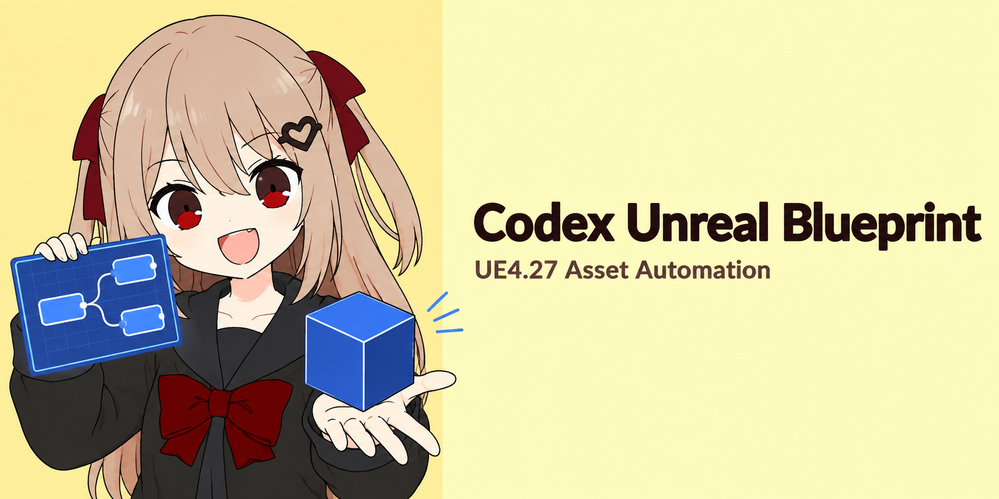

<p align="center">
  
</p>

# Codex Unreal Blueprint

**简体中文** · [繁體中文](README.zh-TW.md) · [English](README.en.md)

面向 Codex 的 UE4.27 Win64 本地插件：既能在 Editor 在线时安全自动化 Blueprint，也能在 Editor 关闭时直接检查 `.uasset` 和 `.umap`。Skill、MCP server、UE Editor plugin 与离线解析器一次安装，无需额外安装 `inspect-unreal-uassets`。

## ✨ 主要能力

- 在线或离线检查 Unreal 资产，并明确区分 `generic`、`specialized`、`editable` 三层能力。
- 创建、复制、移动、重命名、编辑和删除常用 Blueprint 资产。
- 编辑组件、变量、Graph、节点、Pin、连接、UMG WidgetTree 和 AnimBlueprint。
- 深度读取 Blueprint、UMG、AnimBlueprint、AnimMontage、Material、Material Instance 和 Niagara System。
- 比较两个资产，并查询依赖与引用；在线使用 Asset Registry，离线返回序列化证据。
- 写入前预检，写入后编译、保存、重载并验证；失败时保留准确资产清单和原始编译信息。

## 🧭 在线、离线与自动路由

| 模式 | 适合场景 | 行为 |
|---|---|---|
| `auto` | 日常使用，推荐 | 有唯一匹配 Editor 时在线处理；没有匹配会话且提供文件路径时转为离线解析 |
| `editor` | 当前未保存状态、精确引用、Blueprint 写入 | 连接带认证的 UE Editor plugin，读取真实 UObject 与 Asset Registry 数据 |
| `offline` | Editor 已关闭、资产只能静态解析、需要磁盘证据 | 使用随包安装的 UAssetAPI 解析器，只读且不声称运行时结果 |

对于可能被 Editor 占用或更适合离线处理的特效等资产，可启用：

```json
{
  "mode": "offline",
  "filePath": "E:/Project/Content/Effects/NS_Test.uasset",
  "contentRoot": "E:/Project/Content",
  "offlineStaging": {
    "enabled": true,
    "maxCachedAssets": 64
  }
}
```

解析器会复制目标 Package 及已有的 `.uexp`、`.ubulk`、`.uptnl` companion 文件，确认复制期间源文件稳定，再解析隔离副本。缓存只按主 `.uasset/.umap` 数量计数；达到上限后自动淘汰最旧快照并继续工作，不会因为历史缓存已满而拒绝新资产。

## 🧩 资产支持范围

| 资产类型 | 专用读取 | 在线编辑 |
|---|---:|---:|
| 普通 Blueprint、Actor、ActorComponent、Interface、Function/Macro Library | ✅ | ✅ |
| UMG / Widget Blueprint | ✅ WidgetTree、Graph、动画、属性 | ✅ 已有资产 |
| Animation Blueprint | ✅ AnimGraph、状态机、变量 | ✅ 已有资产 |
| User Defined Struct / Enum、Level Blueprint | ✅ | ✅ |
| AnimMontage | ✅ Section、Slot、Notify、Blend | 只读 |
| Material / Material Instance | ✅ 参数、父材质、Expression | 只读 |
| Niagara System | ✅ 参数、Emitter、Warmup 与序列化证据 | 只读 |
| Texture、Mesh、Sound、DataAsset、Sequence 等其他可加载资产 | 通用属性、依赖、引用、Imports/Exports | 只读 |

当前可直接创建的类型包括普通 Blueprint、Interface、Function Library、Macro Library、Struct 和 Enum。已有 UMG 与 AnimBlueprint 可以深入编辑；专用创建入口暂未暴露。

## 🛠️ Blueprint 自动化

- **资产**：创建、复制、移动、重命名、删除、改父类、增删 Interface、修改 Class Defaults。
- **组件**：添加、移除、重命名、挂接、设置 Root、Transform、属性和继承覆盖。
- **类型**：添加、更新、删除变量；编辑 Struct 字段与 Enum 值。
- **Graph**：创建或删除 Graph，编辑函数签名、局部变量、Dispatcher、节点、Pin 和连接。
- **UMG**：编辑控件层级、Named Slot、属性、事件、Binding、导航、无障碍和时间轴动画。
- **AnimBlueprint**：编辑 Skeleton、父类、AnimGraph 节点、状态机、State、Conduit、Transition、Pose Link 与 Event Graph。

具体 operation 及参数由运行中 UE plugin 的 Operation Registry 动态提供，Skill 不猜测不存在的节点或字段。

## 🛡️ 写入安全

每次写请求都需要唯一 `requestId`，并依次执行：

```text
严格预检 → UE Transaction → 修改 → 编译 → 保存 → 重载 → 结构验证
```

- 目标 Package 已 Dirty、Source Control Checkout 失败、Schema 不匹配或编译失败时明确停止。
- 连接状态不明时查询原 `requestId`，不会盲目重放写请求。
- 部分失败会返回 `modified`、`saved`、`notSaved`、`unknown` 等准确清单。
- 插件不自动备份或还原二进制资产；Git/SVN 恢复由用户根据清单手工执行。

## 🚀 安装

要求：Windows、UE4.27、PowerShell 7、Node.js 22.19+、.NET SDK 8+、Visual Studio C++ 工具链，以及 Codex Desktop/CLI。

首次安装或 UE plugin 有更新时，先关闭目标 Editor，再运行：

```powershell
npm install
pwsh ./scripts/setup.ps1 `
  -UProject E:/Project/MyGame.uproject `
  -EngineRoot E:/UE_4.27
```

脚本会运行检查、构建 UE4.27 Win64 plugin、同步受管文件，并安装个人 Codex plugin。完成后重启 Editor，并新建 Codex task。

如果 UE plugin 已是最新版，本次只更新 Skill、MCP server 或离线解析器，可以保持 Editor 开启：

```powershell
pwsh ./scripts/setup.ps1 -CodexOnly
```

此时无需重启 Editor，只需新建 Codex task。自动找不到 CLI 时再传 `-CodexExecutable C:/path/to/codex.exe`。

## 💬 使用示例

安装完成后，可以直接告诉 Codex：

- “检查这个 UMG 的 WidgetTree 和按钮事件。”
- “比较这两个 Niagara，看参数和 Emitter 有什么区别。”
- “给这个 Actor Blueprint 添加组件、变量和初始化节点并验证。”
- “Editor 不要关，把这个特效复制到离线缓存后解析。”
- “查找谁引用了这个 Blueprint，并区分在线证据和离线证据。”

## 🧰 MCP 工具

- **环境与搜索**：`unreal_status`、`unreal_doctor`、`unreal_search`
- **通用资产**：`unreal_asset_inspect`、`unreal_asset_compare`、`unreal_asset_referencers`
- **Blueprint 工作流**：`blueprint_capabilities`、`blueprint_inspect`、`blueprint_validate`、`blueprint_apply`、`blueprint_job`、`blueprint_verify`

协议 `2.0.0` 将 validate、apply、verify 统一为 Job：携带 `requestId` 提交一次，再通过 `blueprint_job` 查询或等待。批量组件、精确属性检查和结构断言继续复用同一套十二工具，不增加同义工具。

## 📚 文档

- [安装与本地开发](Docs/setup.zh-CN.md)
- [架构与能力分层](Docs/architecture.zh-CN.md)
- [MCP 工具参考](Docs/mcp-reference.zh-CN.md)
- [Git/SVN 手工恢复](Docs/source-control-recovery.zh-CN.md)
- [v1.0.0 发布门槛](Docs/v1-release-gate.zh-CN.md)

## ⚠️ 使用边界

- 离线结果是磁盘序列化证据，不能证明 Construction Script、Lua/C++ 或运行时修改后的最终状态。
- Cooked、unversioned、损坏或高度自定义序列化的 Package 可能只能部分解析。
- Material、Niagara、AnimMontage 和其他非 Blueprint 资产当前以检查、比较和引用分析为主，不执行写入。
- 支持目标为 UE4.27 Win64；其他引擎版本尚未声明兼容。

## 🤝 开发与许可

```powershell
npm run check
```

贡献前请阅读 [CONTRIBUTING.md](CONTRIBUTING.md) 和 [SECURITY.md](SECURITY.md)。项目使用 [MIT License](LICENSE)，离线解析器的第三方声明见 [THIRD_PARTY_NOTICES.md](THIRD_PARTY_NOTICES.md)。
